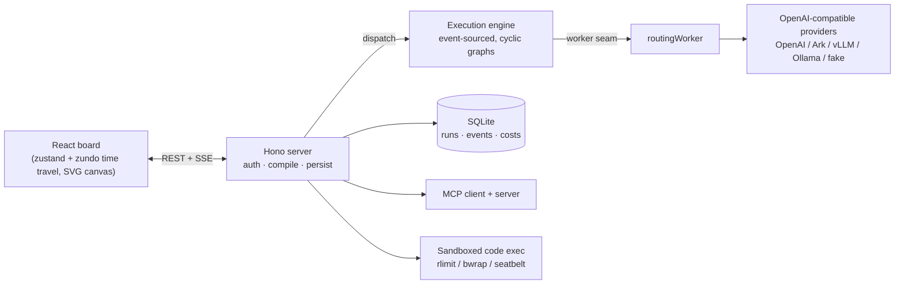

# Agent World

[](LICENSE)
[](https://nodejs.org)
[](https://pnpm.io)
[](#run-the-checks)

**A visual pipeline platform for AI agents — orchestrate LLMs, tools, and quality
control into production lines that actually finish.**

Chat fails at production work: a marketing asset needs *research → draft →
review → revise*, each step may loop, and someone has to guarantee the output
passes quality bar before it ships. Agent World models that as a **pipeline
graph** you draw on a canvas — agents are nodes, quality gates send work back
for rework, and every run is fully replayable.

```text
source ──▶ agent(draft) ──▶ gate(LLM judge) ──✗──▶ rework back to draft
                                │✓
                                ▼
                          agent(polish) ──▶ sink(final output)
```

## Why it's different

Most agent frameworks treat a run as a black box that either works or doesn't.
This codebase encodes three different bets:

**1. Rework loops are a construct, not an arbitrary cycle.** A critic sending
work back to a builder makes the graph non-acyclic — unschedulable in a naive
engine. Here a gate *owns* a `rework` edge, and the compiler enforces one
invariant: dropping every rework edge must leave a DAG, and each rework edge
must land on an ancestor of its gate. That buys a real execution plan
(topological order + bounded loop body) while work still flows backwards.
Exhausted gates follow an explicit `pass` / `scrap` / `halt` policy — never an
infinite loop. There are also `error` edges: node failure routes to a catch
branch instead of killing the run.

**2. The event stream is the single source of truth.** Every run appends
immutable events (`node.delta`, `gate.verdict`, `tool.result`, …); runtime
state is a pure fold over them. That one decision pays out five times: pause
& resume, disconnect-reconnect (SSE `Last-Event-ID`), time-travel replay on
the canvas, audit, and A/B comparison — all read the same log. `(runId,
nodeId, attempt)` is the primary key, so attempt 1 and attempt 2 of a reworked
node both survive and can be diffed side by side.

**3. Cost and quality are first-class, metered after the fact.** Tokens are
metered per call as the model responds (never charged up front), `budgetUsd`
is a hard ceiling that trips the whole line, and quality is measured two ways:
a runtime gate (LLM-as-judge with score thresholds, brand-term coverage, and
banned-word checks) and a cross-run report (pass rate, avg rework, avg score —
grouped by prompt fingerprint, so you can see whether last week's prompt
change actually helped).

## Feature map

| Area | What's there |
|---|---|
| **Nodes** | 24 types: agent, gate, HTTP (SSRF-guarded), code exec (JS/Python, sandboxed), branch, map, loop, parallel, table, database, file parse, translate, OCR, convert, search, notify, vcs, human approval, subprocess, image/video/audio gen, source, sink |
| **Triggers** | Manual, webhook, cron (self-hosted parser), event, batch |
| **Quality** | LLM-judge gates, score-rework loops, brand/banned terms, output-contract schema validation |
| **Observability** | Live SSE streaming, replay scrubber, per-node cost, eval report (by day / by graph / by prompt fingerprint), CSV export |
| **MCP** | Both directions: consume external MCP servers as tools; expose the platform itself as an MCP server (15 tools, stdio + HTTP/SSE) |
| **Sandboxing** | 3-tier code exec: env/cwd isolation → rlimit + Node permission model → bwrap (Linux) / seatbelt (macOS); SSRF guard immune to DNS rebinding |
| **Accounts** | JWT + bcrypt, all resources isolated per user |
| **Templates** | 10 built-in pipelines with parameterizable fields (URLs, targets, brand terms) |

## Quick start

Requires **Node >= 24** (for `node:sqlite`) and **pnpm**.

```bash
pnpm install
pnpm dev
```

- Board (web UI): <http://localhost:5173>
- Engine / API: <http://localhost:8791>

### 5-minute first run

1. **Open the board** at <http://localhost:5173> and register an account.
2. **Click 新建产线** — pick a template (e.g. 内容改写循环) or start blank.
3. **Configure a provider** — settings (⚙️) → paste an API key + base URL for
   any OpenAI-compatible endpoint (OpenAI, Volcengine Ark, vLLM, Ollama, …).
   No key? A deterministic **fake worker** takes over — enough to learn the UI
   and run tests.
4. **Edit the graph** — double-click a node to open the inspector; drag from a
   node's right edge to another's left edge to connect.
5. **Click 运行** — watch tokens stream through the pipes; if the gate fails
   the work, it flows back for rework.
6. **Inspect** — click any node for attempts, scores, cost, and artifacts;
   the 成品仓 (sink) renders the final output with images and video inline.

<!-- TODO: replace with an animated GIF of a run (canvas + rework loop + timeline scrub) -->
<!--  -->

### Run the checks

```bash
pnpm -r test       # 680+ tests: core 146 / server 466 / mcp-server 50 / web 19
pnpm -r typecheck
pnpm -r build
```

## Architecture



The event stream is the contract between server and board: the engine appends
events, SQLite stores them, the board folds them into UI state — the live view
and the replay scrubber run the same reducer.

```
packages/core     graph schema (zod), compiler, event schema, runtime reducer — zero deps, shared by both sides
packages/server   execution engine, sandbox, HTTP + SSE API, SQLite persistence
packages/mcp-server  the platform as an MCP server (15 tools, 2 transports)
apps/web          the board: SVG canvas, inspector, timeline, reports
```

## Documentation

The full index (every doc, tagged current/historical/archived) lives in
[docs/README.md](docs/README.md). Quick pointers:

- [handoff.md](handoff.md) — current state and active work (read first when resuming)
- [docs/examples.md](docs/examples.md) — 12 ready-to-use pipeline examples
- [docs/extending.md](docs/extending.md) — add workers, connectors, skills, triggers, node types
- [docs/design-code-sandbox.md](docs/design-code-sandbox.md) — why the sandbox has 3 tiers
- [docs/design-mcp-server.md](docs/design-mcp-server.md) — MCP server design
- [CHANGELOG.md](CHANGELOG.md) · [CONTRIBUTING.md](CONTRIBUTING.md)

## Deployment

Multi-stage `Dockerfile` (Node 24) builds core + server and runs
`node dist/index.js`; `docker-compose.yml` exposes port 8791 with a persistent
SQLite volume. Set `CORS_ORIGINS` in any hosted deployment (unset allows all
origins — local dev only). `MCP_SERVERS` registers external MCP tools.

MIT license — see [LICENSE](LICENSE).
