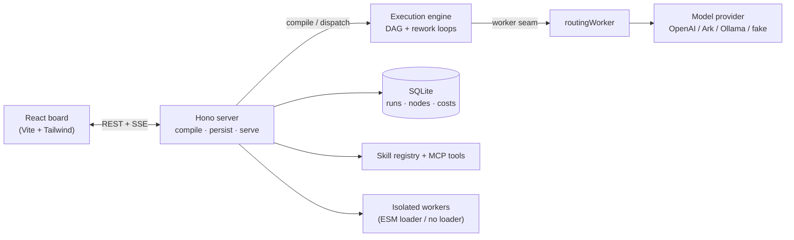

# Agent World

[](LICENSE)
[](https://nodejs.org)
[](https://pnpm.io)
[](https://pnpm.io/workspaces)

A game-style workbench for multi-agent orchestration. Each agent is a plant on an
industrial line, tokens are electricity, and output moves between plants on pipes and
trucks. This repo is the product; the marketing site lives separately.

## Quick start

Requires **Node >= 24** (for `node:sqlite`) and **pnpm**.

```bash
pnpm install
pnpm dev
```

- Engine / API: <http://localhost:8791>
- Board (web UI): <http://localhost:5183>

Run the checks:

```bash
pnpm -r test       # unit tests
pnpm -r typecheck  # type checks
pnpm -r build      # production build
```

Open the board, click **新建产线** to start from a template or a blank line, then
**运行** to watch the transcript stream. See [handoff.md](handoff.md) for the
current code state and next steps.

## The two decisions this codebase encodes

**Rework loops are a construct, not an arbitrary cycle.** A critic that sends work back
to a builder makes the graph non-acyclic, which would make it unschedulable. Instead a
gate owns a `rework` edge, and the compiler enforces one invariant: dropping every
rework edge must leave a DAG, and each rework edge must land on an ancestor of its gate
within that DAG. That buys a real execution plan (topological order plus a bounded loop
body) while still letting work flow backwards. A gate that runs out of attempts follows
its `onExhausted` policy — `pass`, `scrap`, or `halt` for a human to pick up.

**An attempt is part of a node run's identity.** `(runId, nodeId, attempt)` is the
primary key, not a counter that gets overwritten. Attempt 1 and attempt 2 both survive,
so the inspector can show them side by side and diff them.

Electricity is metered after each call returns, never charged up front, because token
cost is only knowable once the model responds. The budget is a hard ceiling on top of
that meter: cross it and the whole line trips.

## Layout

```
packages/core     graph schema, compiler, event schema, runtime reducer (zero deps, runs both sides)
packages/server   execution engine, worker seam, SQLite persistence, HTTP + SSE
apps/web          the board: plants, pipes, trucks, pan/zoom canvas, minimap, control panel, replay scrubber
```

The event stream is the single source of truth. Runtime state is a pure fold over it,
which means replay is just re-folding a prefix — the scrubber and the live view run the
same reducer.

`packages/server/src/worker.ts` is the seam between orchestration and model calls. The
server ships with an OpenAI-compatible worker (Agnes, OpenAI, Volcengine Ark, vLLM,
Ollama, …) configured in the settings panel; a deterministic offline fake worker is the
fallback for tests and when no provider is enabled.

### Architecture



The event stream is the contract between server and board: the engine appends events,
SQLite stores them, and the board folds them into UI state — live and replay use the
same reducer.

## Canvas interaction

- Pan: select-mode drag, middle-mouse drag, or hold Space and drag anywhere. Arrow keys nudge (Shift = faster).
- Zoom: cursor-anchored wheel, or the minimap +/−. `F` frames the selected plant.
- Pipes: hover or click one to highlight its whole up/downstream flow; Delete/Backspace removes the selected pipe.
- Plants: drag snaps to a 20px grid; ⌘/Ctrl+C copies the selected plant, ⌘/Ctrl+V pastes a copy.
- The "快捷键 ?" button in the top bar lists every shortcut.

## Documentation

- [PRD.md](PRD.md) — phased product roadmap and architectural guardrails
- [handoff.md](handoff.md) — current code state and next steps
- [docs/product-vision-discussion.md](docs/product-vision-discussion.md) — capabilities, design language, technology choices, commercialization
- [docs/technical-design.md](docs/technical-design.md) — architecture, data models, API surface
- [docs/roadmap-tasks.md](docs/roadmap-tasks.md) — concrete per-phase task breakdown
- [CONTRIBUTING.md](CONTRIBUTING.md) — how to set up, run checks, and open a PR

## Deployment

A multi-stage `Dockerfile` (Node 24) builds the core + server packages and runs
`node dist/index.js`; `docker-compose.yml` exposes the engine on port `8791` with a
persistent SQLite volume. Useful env hooks in the compose file: `CORS_ORIGINS`
(comma-separated allow-list — **set this in any hosted/private deployment**; when
unset the server allows all origins, which is only for local dev) and `MCP_SERVERS`.

See `CHANGELOG.md` for release notes and `LICENSE` (MIT).
